<p align="center">
  
</p>

[](https://www.npmjs.com/package/@vlandoss/env)
[](https://github.com/variableland/env/actions/workflows/ci.yml)
[](https://github.com/changesets/changesets)

Contract-first environment configuration with typed schemas — runtime-agnostic core (Node, Bun, Deno, browser, Workers, Edge) with opt-in adapters for Node, Vite, and React (SSR).

```bash
pnpm add @vlandoss/env
```

📚 **[env.oss.variable.land](https://env.oss.variable.land)** — full docs

## Repository

This is the monorepo. Three things live here:

| Path                      | What it is                                                                                                                      |
| ------------------------- | ------------------------------------------------------------------------------------------------------------------------------- |
| [`package/`](./package)   | The [`@vlandoss/env`](./package) library — published to npm                                                                     |
| [`docsite/`](./docsite)   | The Fumadocs site behind [env.oss.variable.land](https://env.oss.variable.land), on Cloudflare Workers                          |
| [`examples/`](./examples) | 9 runtime-isolated demos (Node, Bun, Deno, Workers, Edge, Vite SPA, SSR) — each one is a real consumer of the published tarball |

## Working on it

The whole thing is orchestrated with [mise](https://mise.jdx.dev). Get the runtimes, install, run the e2e suites:

```bash
mise install        # installs node + pnpm; bun/deno added on demand by examples
mise run setup      # root deps + pack the library + install every example + Playwright browsers
mise run test:e2e   # runs the e2e suite of every example
```

Day-to-day:

```bash
mise run docsite     # docs site dev server
mise run lib:test    # unit tests for @vlandoss/env
mise run lib:build   # build @vlandoss/env
mise run test:static # JS & TS check across package + docsite
```

Run `mise tasks` for the full list.

For everything else — the per-task reference, the per-example layout, how to iterate on the library while seeing changes in the examples, troubleshooting — see [DEVELOPMENT.md](./docs/DEVELOPMENT.md).

## Contributing

Issues, ideas, and PRs welcome. Read [CONTRIBUTING.md](./docs/CONTRIBUTING.md) before opening a PR — it covers the branch / commit / changeset conventions and the release flow.

## License

[MIT](./LICENSE) © [Variable Land](https://variable.land)
